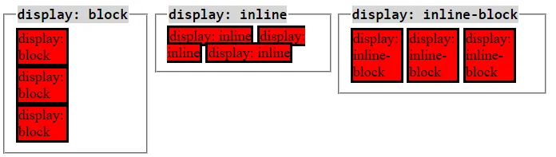
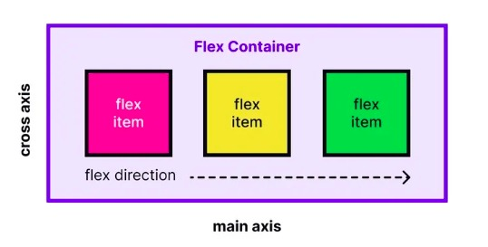
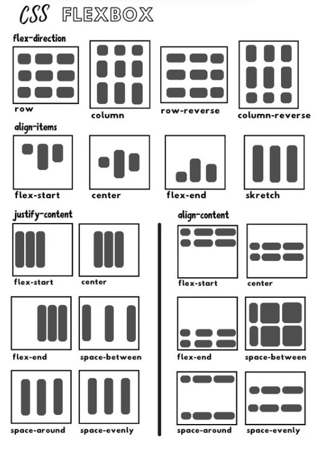

# Meet 2 - CSS Dasar

## Tujuan Pembelajaran
Setelah sesi ini, peserta diharapkan dapat:
- Memahami berbagai jenis CSS selector
- Menggunakan warna dengan format berbeda (hex, rgb, named color)
- Memahami Box Model (margin, padding, border)
- Menggunakan berbagai satuan CSS (px, rem, %, dll)
- Memahami konsep box-sizing

---

## 1. CSS Selector

Selector digunakan untuk memilih elemen HTML yang ingin diberi style.

### Jenis-jenis Selector

#### a. Element Selector
Memilih elemen berdasarkan nama tag HTML.
```css
p {
    color: blue;
}
```

#### b. Class Selector
Memilih elemen berdasarkan atribut `class`. Dimulai dengan titik (`.`).
```css
.highlight {
    background-color: yellow;
}
```

#### c. ID Selector
Memilih elemen berdasarkan atribut `id`. Dimulai dengan hash (`#`).
```css
#special {
    font-weight: bold;
}
```

#### d. Multiple Class Selector
Satu elemen bisa punya banyak class.
```css
.btn { /* style dasar */ }
.btn-primary { /* style tambahan */ }
```

---

## 2. Warna di CSS

Ada beberapa cara menulis warna di CSS:

### a. Named Colors
```css
color: red;
background-color: coral;
```
Lebih dari 140 warna yang punya nama.

### b. Hexadecimal (Hex)
```css
color: #3498db;      /* biru */
background-color: #2ecc71;  /* hijau */
```
Format: `#RRGGBB` (Red, Green, Blue)

### c. RGB / RGBA
```css
color: rgb(52, 152, 219);           /* biru */
background-color: rgba(46, 204, 113, 0.5);  /* hijau semi-transparan */
```
- RGB: Red, Green, Blue (0-255)
- RGBA: + Alpha untuk transparansi (0-1)

---

## 3. Box Model

Setiap elemen HTML adalah "box" yang terdiri dari:

```
┌─────────────────────────────┐
│        MARGIN               │ ← Ruang luar (transparan)
│  ┌───────────────────────┐  │
│  │     BORDER            │  │ ← Garis tepi
│  │  ┌─────────────────┐  │  │
│  │  │   PADDING       │  │  │ ← Ruang dalam
│  │  │  ┌───────────┐  │  │  │
│  │  │  │  CONTENT  │  │  │  │ ← Konten (text, gambar, dll)
│  │  │  └───────────┘  │  │  │
│  │  └─────────────────┘  │  │
│  └───────────────────────┘  │
└─────────────────────────────┘
```

### Properti Box Model

#### Margin
Ruang di luar border (membuat jarak dengan elemen lain).
```css
margin: 20px;                    /* semua sisi */
margin: 10px 20px;              /* atas-bawah kiri-kanan */
margin: 10px 15px 20px 25px;   /* atas kanan bawah kiri (searah jarum jam) */

/* atau per sisi */
margin-top: 10px;
margin-right: 15px;
margin-bottom: 20px;
margin-left: 25px;
```

#### Padding
Ruang di dalam border (antara content dan border).
```css
padding: 20px;                   /* semua sisi */
padding: 10px 20px;             /* atas-bawah kiri-kanan */
padding: 10px 15px 20px 25px;  /* atas kanan bawah kiri */

/* atau per sisi */
padding-top: 10px;
padding-right: 15px;
```

#### Border
Garis tepi elemen.
```css
border: 2px solid black;         /* width style color */
border-radius: 10px;             /* rounded corners */

/* atau per sisi */
border-top: 1px solid gray;
border-bottom: 2px dashed blue;
```

---

## 4. Satuan di CSS

### a. Absolute Units (Ukuran Tetap)

#### Pixel (px)
```css
width: 200px;
font-size: 16px;
```
- Paling umum digunakan
- Ukuran tetap, tidak berubah

### b. Relative Units (Ukuran Relatif)

#### Percentage (%)
```css
width: 50%;    /* 50% dari parent */
margin: 10%;
```
- Relatif terhadap elemen parent

#### rem (root em)
```css
font-size: 1.5rem;   /* 1.5x ukuran root (biasanya 16px) */
padding: 2rem;       /* 32px jika root = 16px */
```
- Relatif terhadap ukuran font root (`<html>`)
- Lebih konsisten untuk responsive design
- 1rem = 16px (default browser)

#### em
```css
font-size: 1.5em;    /* 1.5x ukuran font parent */
```
- Relatif terhadap font-size parent
- Bisa bertumpuk (nested)

#### Viewport Units
```css
width: 100vw;    /* 100% lebar viewport */
height: 100vh;   /* 100% tinggi viewport */
```
- `vw`: viewport width
- `vh`: viewport height

### Kapan Pakai Apa?

| Satuan | Gunakan untuk |
|--------|---------------|
| `px` | Border, small fixed sizes |
| `rem` | Font-size, spacing (padding/margin) |
| `%` | Width, responsive layouts |
| `em` | Spacing relatif dalam komponen |
| `vw/vh` | Full-screen sections |

---

## 5. Box-Sizing

Mengatur cara browser menghitung ukuran elemen.

### content-box (default)
```css
box-sizing: content-box;
```
- Width hanya menghitung content
- Padding dan border ditambahkan di luar

**Contoh:**
```css
.box {
    width: 200px;
    padding: 20px;
    border: 2px solid black;
}
```
Total width = 200px + 40px (padding) + 4px (border) = **244px**

### border-box (recommended)
```css
box-sizing: border-box;
```
- Width sudah termasuk padding dan border
- Lebih mudah dihitung!

**Contoh:**
```css
.box {
    box-sizing: border-box;
    width: 200px;
    padding: 20px;
    border: 2px solid black;
}
```
Total width = **200px** (sudah termasuk semua!)

### Best Practice
```css
/* Terapkan ke semua elemen */
* {
    box-sizing: border-box;
}
```

---

## Materi Pengayaan

### 6. Display Property: Block, Inline, Inline-Block

Setiap elemen HTML punya display default yang menentukan bagaimana elemen ditampilkan.



#### Block
```css
display: block;
```
- Elemen mengambil **seluruh lebar** yang tersedia
- Dimulai di **baris baru**
- Bisa diatur `width` dan `height`
- Contoh: `<div>`, `<p>`, `<h1>`, `<section>`

#### Inline
```css
display: inline;
```
- Elemen hanya mengambil **lebar sesuai content**
- **Tidak dimulai di baris baru** (sejajar)
- `width` dan `height` **tidak berfungsi**
- Contoh: `<span>`, `<a>`, `<strong>`

#### Inline-Block
```css
display: inline-block;
```
- Gabungan inline + block
- Sejajar seperti inline, tapi bisa diatur `width` dan `height`
- Berguna untuk button, card kecil yang sejajar

**Contoh Penggunaan:**
```css
/* Membuat link menjadi button */
.btn {
    display: inline-block;
    padding: 10px 20px;
    background-color: blue;
    color: white;
}
```

---

### 7. Flexbox Basics

Flexbox adalah sistem layout modern untuk mengatur elemen dalam satu dimensi (row atau column).



#### Mengaktifkan Flexbox
```css
.container {
    display: flex;
}
```

#### Flex Direction
Menentukan arah layout:
```css
.container {
    display: flex;
    flex-direction: row;        /* horizontal (default) */
    flex-direction: column;     /* vertical */
    flex-direction: row-reverse;    /* horizontal terbalik */
    flex-direction: column-reverse; /* vertical terbalik */
}
```

#### Flex Wrap
Mengatur apakah item boleh wrap ke baris baru:
```css
.container {
    display: flex;
    flex-wrap: wrap;      /* boleh wrap */
    flex-wrap: nowrap;    /* tidak wrap (default) */
}
```

#### Justify Content & Align Items



**Justify Content** - mengatur posisi horizontal (main axis):
```css
.container {
    display: flex;
    justify-content: flex-start;    /* kiri (default) */
    justify-content: center;        /* tengah */
    justify-content: flex-end;      /* kanan */
    justify-content: space-between; /* jarak rata di antara item */
    justify-content: space-around;  /* jarak rata + spacing di pinggir */
    justify-content: space-evenly;  /* jarak sama rata semua */
}
```

**Align Items** - mengatur posisi vertikal (cross axis):
```css
.container {
    display: flex;
    align-items: stretch;     /* stretch penuh (default) */
    align-items: flex-start;  /* atas */
    align-items: center;      /* tengah */
    align-items: flex-end;    /* bawah */
}
```

**Gap** - jarak antar item:
```css
.container {
    display: flex;
    gap: 20px;           /* jarak 20px antar item */
    gap: 10px 20px;      /* row-gap column-gap */
}
```

#### Contoh Praktis: Navbar
```css
.navbar {
    display: flex;
    justify-content: space-between;  /* logo kiri, menu kanan */
    align-items: center;              /* center vertikal */
    padding: 15px;
}
```

#### Contoh Praktis: Card Grid
```css
.card-container {
    display: flex;
    flex-wrap: wrap;
    gap: 20px;
}

.card {
    width: calc(50% - 10px);  /* 2 kolom dengan gap */
}
```

---

### 8. CSS Grid (Bonus)

Grid adalah sistem layout untuk dua dimensi (row DAN column sekaligus).

#### Mengaktifkan Grid
```css
.container {
    display: grid;
    grid-template-columns: 1fr 1fr;   /* 2 kolom sama besar */
    gap: 20px;
}
```

#### Fractional Unit (fr)
`fr` = fraction (bagian) dari ruang yang tersedia
```css
grid-template-columns: 1fr 1fr;        /* 2 kolom sama besar */
grid-template-columns: 1fr 2fr;        /* kolom 2 dua kali lebih besar */
grid-template-columns: 200px 1fr;      /* kolom 1 fixed, kolom 2 flexible */
```

#### Repeat Function
```css
grid-template-columns: repeat(3, 1fr);  /* 3 kolom sama besar */
grid-template-columns: repeat(2, 200px); /* 2 kolom @ 200px */
```

#### Contoh: 2 Kolom Layout
```css
.container {
    display: grid;
    grid-template-columns: 1fr 1fr;
    gap: 20px;
}
```

#### Contoh: 3 Kolom Responsive
```css
.container {
    display: grid;
    grid-template-columns: repeat(3, 1fr);
    gap: 20px;
}
```

---

### Flexbox vs Grid: Kapan Pakai?

| Gunakan | Untuk |
|---------|-------|
| **Flexbox** | Layout 1 dimensi (navbar, button group, card row) |
| **Grid** | Layout 2 dimensi (card grid, dashboard, complex layouts) |

**Rule of thumb:**
- Kalau cuma butuh horizontal ATAU vertical → Flexbox
- Kalau butuh horizontal DAN vertical sekaligus → Grid

---

## Tips & Tricks

1. **Developer Tools**: Tekan F12, klik elemen, lihat Box Model di tab "Computed"
2. **Margin Collapse**: Vertical margin bisa "collapse" (bergabung)
3. **Centering dengan Margin**: `margin: 0 auto;` untuk center horizontal
4. **Border Debug**: Tambahkan `border: 1px solid red;` untuk debug layout
5. **Flexbox Inspector**: Di DevTools, elemen dengan `display: flex` ada icon khusus untuk debug
6. **Grid Inspector**: Di DevTools, elemen dengan `display: grid` bisa lihat grid lines

---

## Resources

- [MDN CSS Selectors](https://developer.mozilla.org/en-US/docs/Web/CSS/CSS_Selectors)
- [MDN Box Model](https://developer.mozilla.org/en-US/docs/Learn/CSS/Building_blocks/The_box_model)
- [CSS Units Cheatsheet](https://developer.mozilla.org/en-US/docs/Learn/CSS/Building_blocks/Values_and_units)
- [Color Picker Tool](https://htmlcolorcodes.com/)
- [Flexbox Froggy](https://flexboxfroggy.com/) - Game belajar Flexbox
- [Grid Garden](https://cssgridgarden.com/) - Game belajar Grid
- [CSS Tricks Flexbox Guide](https://css-tricks.com/snippets/css/a-guide-to-flexbox/)
- [CSS Tricks Grid Guide](https://css-tricks.com/snippets/css/complete-guide-grid/)

---

